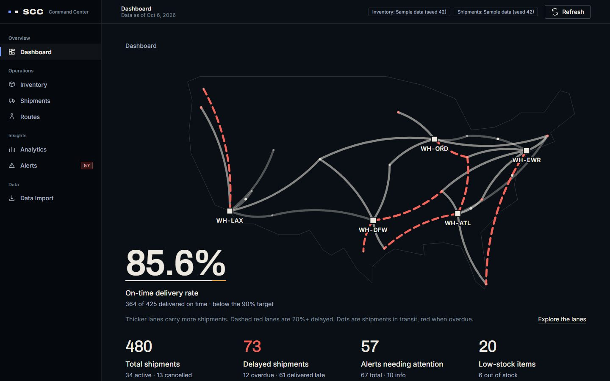
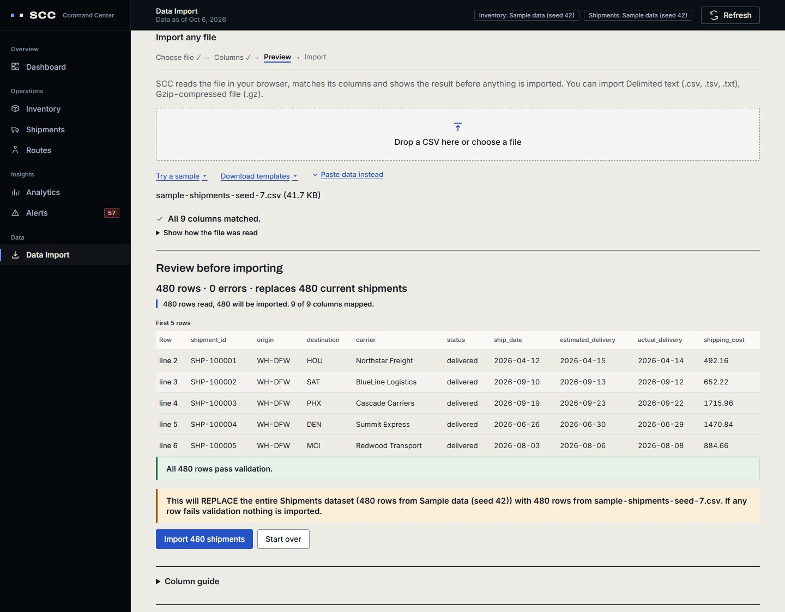
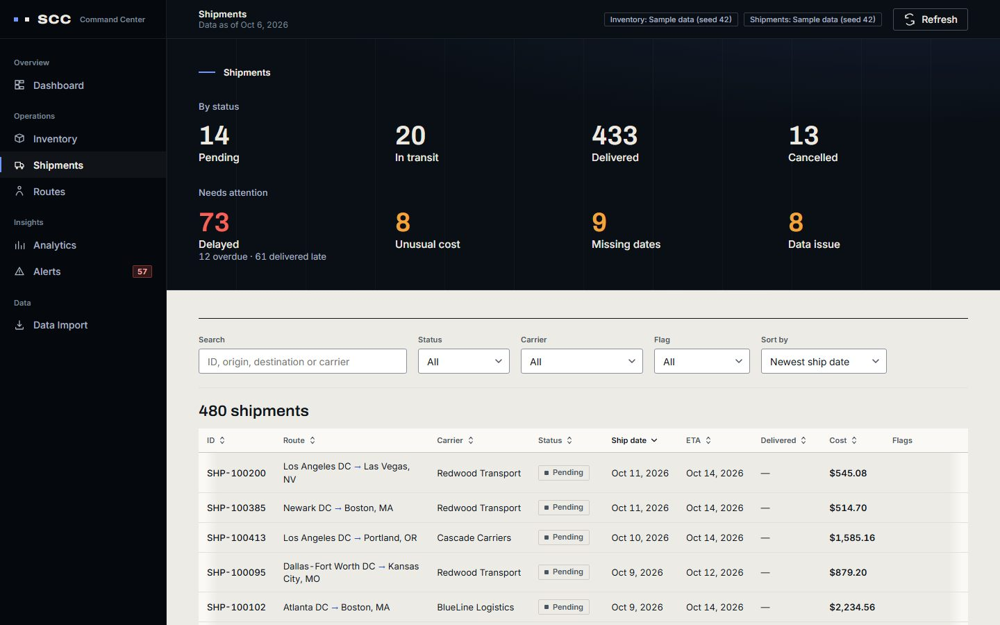
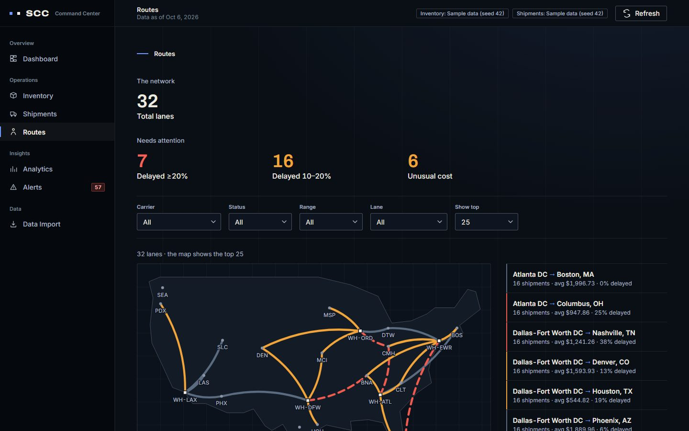
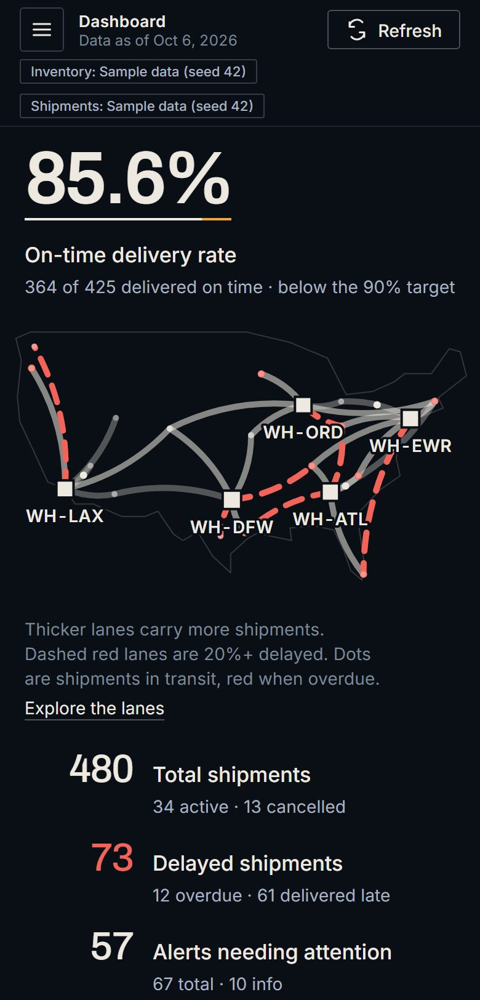

<a name="english"></a>

# Supply Chain Command Center

**English** · [Tiếng Việt](#tieng-viet)

A web dashboard that turns shipment and inventory data into the daily calls a supply chain team makes: which
shipments to chase, which lanes are slipping, and what to reorder first.

**Live demo:** _the link goes here after the first deploy ([docs/DEPLOY.md](docs/DEPLOY.md))._



## What it does

| Page | The decision it supports |
| --- | --- |
| Dashboard | Is the network on track today? On-time rate against a 90% target, delayed lanes on a US map, and the counts that need attention. |
| Inventory | What to reorder first: stock status and stockout risk for every SKU in every warehouse. |
| Shipments | Which shipments to chase: delayed, overdue, missing dates, unusual cost or bad data. |
| Routes | Which lanes to raise with the carrier: share of late shipments and average cost per lane. |
| Analytics | Whether things are getting better: on-time vs delayed by month, shipping cost over time, inventory value and turnover. |
| Alerts | What to fix first: every problem in one list, Critical first, each linked to the record behind it. |
| Data Import | How the picture changes with your own data: load a shipments or inventory file, check every row, then import it or go back to the sample. |

## Try it in 3 clicks

1. Open **Data Import**, click **Try a sample** and choose **Shipments sample**.
2. Read the preview (480 rows, 0 errors) and click **Import 480 shipments**.
3. Open **Dashboard**. The figures now come from the new file: on-time delivery moves from 85.6% to 91.0%, and
   delayed shipments from 73 to 50.

To go back, click **Restore sample data** at the bottom of Data Import.



## How it works

- **Stack.** React and TypeScript in the browser, built with Vite. A small Node.js server (`node:http`, no
  framework) keeps the data in memory and serves a JSON API. Charts and the map are hand-written SVG. The only
  runtime dependencies are React and two self-hosted fonts.
- **Import.** The browser reads the file (CSV, TSV, TXT or gzip), matches its columns to the fields SCC needs and
  shows a preview with every problem listed by line and column. The server checks every row again. If any row
  fails, nothing is imported.
- **On-time rate.** Of the delivered shipments with known dates, the share that arrived on or before the
  estimated delivery day.
- **Cost anomaly.** Each shipment is compared with similar shipments: the same route and carrier, or a wider group
  when there are fewer than 8. It is flagged only when it is a statistical outlier (modified z-score above 3.5)
  and also costs at least 1.5 times the group's median, so ordinary price variation is not reported.
- **Stockout risk.** Days of supply = units on hand ÷ average daily usage. High when the item is out of stock or
  its days of supply are shorter than the supplier lead time; Medium within 7 days of the lead time; Low
  otherwise; Unknown when there is no usage data.

The sample data (seed 42) has 360 inventory records in 5 warehouses and 480 shipments, with problems placed on
purpose so that every alert type appears. Its dates are counted from today, so it always looks current.





## Quality

- **2,146 automated tests** (Vitest) cover the calculations, the import pipeline, the server and every page.
  9 of them compare against the private development history and are skipped in this repository.
- **41 browser tests** drive real Chromium against the built app. They check that no page scrolls sideways
  from 360px to 1440px wide, that the dashboard text meets WCAG AA contrast, that focus moves to the page heading
  after each navigation, and that reduced-motion settings are respected. Playwright is not a project dependency;
  see Run locally.
- **Colour carries meaning only.** Red is kept for critical and late, amber for warnings, and colours always sit
  next to a text label or a legend.
- **Strict TypeScript.** `tsc --noEmit` runs as part of every build.



## Why I built this

SCC is a personal project. I built it to learn things I wanted to get better at: analyzing operations data,
designing dashboards that lead to a decision, and building a complete web application from the data to the
screen. It is also a foundation I can build on in the next steps of my supply chain studies and career. All data
in it is generated sample data, not data from a real company.

## How it was built

SCC was developed with an AI coding assistant, Claude Code, which wrote the code. My part was the product
direction, the design decisions and the supply chain logic behind each page: I reviewed every plan before work
started and checked every result before accepting it.

## Run locally

Requires Node.js 22 or later.

```bash
npm ci
npm run dev
```

Then open http://127.0.0.1:3000. For a production build:

```bash
npm run build
npm start
```

To use another port: `PORT=4000 npm start` (macOS, Linux), `$env:PORT=4000; npm start` (PowerShell) or
`set "PORT=4000" && npm start` (Windows cmd).

| Variable | Default | Meaning |
| --- | --- | --- |
| `PORT` | `3000` | Port to listen on |
| `HOST` | `127.0.0.1` | Address to listen on |
| `SCC_SEED` | `42` | Seed for the sample data |
| `SCC_TODAY` | today | Fixes "today" (`YYYY-MM-DD`) |
| `SCC_MAX_UPLOAD_BYTES` | `2097152` | Largest accepted upload |
| `SCC_PUBLIC_HOST` | (none) | Public hostname of a hosted demo |

Tests:

```bash
npm test
npm run typecheck
```

Browser tests need Playwright and Chromium, installed separately:

```bash
npm install --no-save playwright
npx playwright install chromium
npm run build
npm run test:browser
```

To put the demo online: [docs/DEPLOY.md](docs/DEPLOY.md).

## Author

**Đăng Tạo**, Supply Chain student, University of North Texas ·
[linkedin.com/in/dangtao-scm](https://www.linkedin.com/in/dangtao-scm)

---

<a name="tieng-viet"></a>

# Supply Chain Command Center (Tiếng Việt)

[English](#english) · **Tiếng Việt**

Một dashboard web biến dữ liệu lô hàng và tồn kho thành những quyết định hằng ngày của một đội supply chain:
lô nào cần theo sát, tuyến nào đang trễ, và mặt hàng nào cần đặt thêm trước.

**Bản demo:** _link sẽ được thêm sau lần deploy đầu tiên ([docs/DEPLOY.md](docs/DEPLOY.md))._

Ảnh chụp màn hình nằm ở phần tiếng Anh phía trên và trong thư mục [docs/screenshots](docs/screenshots).

## Ứng dụng làm gì

| Trang | Quyết định trang này hỗ trợ |
| --- | --- |
| Dashboard | Mạng lưới hôm nay có ổn không? Tỷ lệ giao đúng hẹn so với mục tiêu 90%, các tuyến trễ trên bản đồ Mỹ, và những con số cần chú ý. |
| Inventory | Cần đặt thêm gì trước: tình trạng tồn kho và rủi ro hết hàng của từng SKU ở từng kho. |
| Shipments | Lô nào cần theo sát: trễ, quá hạn, thiếu ngày, chi phí bất thường hoặc dữ liệu sai. |
| Routes | Tuyến nào cần trao đổi với hãng vận chuyển: tỷ lệ lô trễ và chi phí trung bình của từng tuyến. |
| Analytics | Tình hình có đang tốt lên không: đúng hẹn và trễ theo tháng, chi phí vận chuyển theo thời gian, giá trị và vòng quay tồn kho. |
| Alerts | Sửa gì trước: mọi vấn đề trong một danh sách, Critical đứng đầu, mỗi dòng dẫn tới bản ghi gốc. |
| Data Import | Bức tranh thay đổi ra sao với dữ liệu của bạn: nạp file lô hàng hoặc tồn kho, kiểm tra từng dòng, rồi nhập hoặc quay về dữ liệu mẫu. |

## Dùng thử trong 3 bước

1. Mở **Data Import**, bấm **Try a sample** và chọn **Shipments sample**.
2. Xem bản xem trước (480 dòng, 0 lỗi) rồi bấm **Import 480 shipments**.
3. Mở **Dashboard**. Số liệu giờ lấy từ file mới: tỷ lệ giao đúng hẹn đổi từ 85,6% thành 91,0%, số lô trễ từ 73
   còn 50.

Muốn quay lại, bấm **Restore sample data** ở cuối trang Data Import.

## Cách hoạt động

- **Công nghệ.** Giao diện React và TypeScript, build bằng Vite. Một server Node.js nhỏ (`node:http`, không dùng
  framework) giữ dữ liệu trong bộ nhớ và trả về JSON API. Biểu đồ và bản đồ được vẽ bằng SVG tự viết. Thư viện
  chạy thực tế chỉ có React và hai font tự host.
- **Nhập dữ liệu.** Trình duyệt đọc file (CSV, TSV, TXT hoặc gzip), ghép các cột với trường SCC cần, rồi hiện bản
  xem trước liệt kê mọi lỗi theo dòng và cột. Server kiểm tra lại từng dòng. Chỉ cần một dòng sai là không có gì
  được nhập.
- **Tỷ lệ giao đúng hẹn.** Trong các lô đã giao có đủ ngày, tỷ lệ lô đến vào hoặc trước ngày giao dự kiến.
- **Chi phí bất thường.** Mỗi lô được so với các lô tương tự: cùng tuyến và cùng hãng vận chuyển, hoặc nhóm rộng
  hơn khi nhóm đó có dưới 8 lô. Lô chỉ bị đánh dấu khi vừa là điểm ngoại lai thống kê (modified z-score trên 3,5)
  vừa tốn ít nhất 1,5 lần trung vị của nhóm, để những dao động giá bình thường không bị báo.
- **Rủi ro hết hàng.** Số ngày đủ hàng = số lượng tồn ÷ lượng dùng trung bình mỗi ngày. Cao khi đã hết hàng hoặc số
  ngày đủ hàng ngắn hơn thời gian chờ nhà cung cấp; Trung bình khi chỉ dư dưới 7 ngày so với thời gian chờ; Thấp
  trong các trường hợp còn lại; Chưa rõ khi không có dữ liệu lượng dùng.

Dữ liệu mẫu (seed 42) có 360 dòng tồn kho ở 5 kho và 480 lô hàng, có cài sẵn các vấn đề để loại cảnh báo nào cũng
xuất hiện. Ngày tháng được tính từ hôm nay nên dữ liệu luôn trông như hiện tại.

## Chất lượng

- **2.146 test tự động** (Vitest) cho phần tính toán, quy trình nhập, server và từng trang. 9 test trong số đó so
  với lịch sử phát triển riêng nên được bỏ qua trong repo này.
- **41 test trình duyệt** chạy Chromium thật trên bản đã build. Các test kiểm tra không trang nào cuộn ngang từ
  360px đến 1440px, chữ trên dashboard đạt độ tương phản WCAG AA, focus chuyển tới tiêu đề trang sau mỗi lần
  chuyển trang, và tôn trọng thiết lập giảm chuyển động. Playwright không nằm trong dependency của dự án; xem phần
  Chạy trên máy.
- **Màu chỉ dùng để mang ý nghĩa.** Đỏ dành cho nghiêm trọng và trễ, hổ phách cho cảnh báo, và màu luôn đi kèm
  nhãn chữ hoặc chú giải.
- **TypeScript strict.** `tsc --noEmit` chạy trong mỗi lần build.

## Vì sao mình làm dự án này

SCC là dự án cá nhân. Mình làm để học những điều mình muốn giỏi hơn: phân tích dữ liệu vận hành, thiết kế
dashboard giúp ra quyết định, và xây một ứng dụng web hoàn chỉnh từ dữ liệu tới màn hình. Đây cũng là nền tảng để
mình tiếp tục phát triển trong các bước tiếp theo của việc học và sự nghiệp supply chain. Toàn bộ dữ liệu trong ứng
dụng là dữ liệu mẫu được tạo ra, không phải dữ liệu của công ty thật.

## Cách xây dựng

SCC được phát triển cùng trợ lý lập trình AI Claude Code, công cụ viết phần code. Phần của mình là định hướng sản
phẩm, các quyết định thiết kế và nghiệp vụ supply chain đằng sau từng trang: mình duyệt từng kế hoạch trước khi bắt
đầu và kiểm tra từng kết quả trước khi chấp nhận.

## Chạy trên máy

Cần Node.js 22 trở lên. Các lệnh giống phần tiếng Anh:

```bash
npm ci
npm run dev
```

Mở http://127.0.0.1:3000. Bản production: `npm run build` rồi `npm start`. Test: `npm test` và
`npm run typecheck`. Test trình duyệt cần cài Playwright và Chromium riêng (lệnh ở phần
[Run locally](#run-locally)). Đưa demo lên mạng: [docs/DEPLOY.md](docs/DEPLOY.md).

## Tác giả

**Đăng Tạo**, sinh viên ngành Supply Chain, University of North Texas ·
[linkedin.com/in/dangtao-scm](https://www.linkedin.com/in/dangtao-scm)
